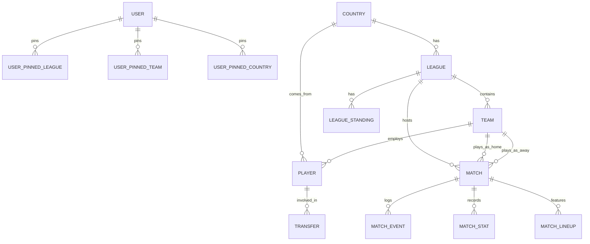

# Rencana Skema Database PostgreSQL - NewsScore

Berdasarkan hasil pemindaian pada *source code* frontend (khususnya struktur halaman di `app/pages/` dan definisi tipe data di `app/types/match.ts`), saya telah menyusun rencana skema database relasional menggunakan **PostgreSQL**. 

Sistem ini membutuhkan penyimpanan data yang sangat terstruktur untuk menangani entitas sepak bola yang kompleks, seperti statistik, klasemen, aktivitas transfer, hingga *live event* pada pertandingan. Selain itu, ada penambahan manajemen otentikasi agar preferensi "Pin/Bookmark" pengguna dapat tersimpan di *server*.

## 1. Analisis Kebutuhan Entitas
Dari struktur antarmuka dan *types*, berikut adalah entitas utama yang perlu disimpan di database:
*   **Geografi & Hierarki**: `Country` (Negara), `League` (Liga/Turnamen).
*   **Klub & Pemain**: `Team` (Klub/Timnas), `Player` (Profil Pemain).
*   **Riwayat Pemain**: `Transfer`, `Player Injury` (Cedera), `Player Career` (Statistik historis per musim).
*   **Pertandingan (Match)**: Jadwal & Hasil, `Match Event`, `Match Stat`, `Lineup`, `Match Odds`, `Commentary`, `Player Match Stat`.
*   **Klasemen**: `Standings` (Klasemen berjalan), `League Archive` (Arsip pemenang musim lalu).
*   **Konten**: `News` (Berita).
*   **Pengguna & Personalisasi (BARU)**: `User` (Akun pengguna), serta relasi pin/bookmark untuk tim, liga, dan negara (`user_pinned_leagues`, `user_pinned_teams`, `user_pinned_countries`).

---

## 2. Diagram Relasi Entitas (ERD)

Di bawah ini adalah gambaran diagram relasi antar tabel-tabel utama:



---

## 3. Desain Tabel dan Kolom

### Akun & Preferensi (Fitur Pin)

#### `users`
*   `id` (UUID, PK)
*   `email` (VARCHAR, UNIQUE)
*   `password_hash` (VARCHAR)
*   `name` (VARCHAR)
*   `created_at` (TIMESTAMP)

#### Tabel Relasi Pin (Bookmark)
*   **`user_pinned_leagues`**: `user_id` (FK), `league_id` (FK). Primary Key gabungan.
*   **`user_pinned_teams`**: `user_id` (FK), `team_id` (FK). Primary Key gabungan (Digunakan juga untuk pin Tim Nasional).
*   **`user_pinned_countries`**: `user_id` (FK), `country_id` (FK). Primary Key gabungan.

### Master Data

#### `countries`
*   `id` (UUID, PK)
*   `name` (VARCHAR)
*   `code` (VARCHAR, opsional untuk flag/bendera)

#### `leagues`
*   `id` (UUID, PK)
*   `country_id` (UUID, FK -> countries)
*   `name` (VARCHAR)
*   `season` (VARCHAR) - cth: "2023/2024"
*   `type` (VARCHAR) - 'league', 'cup', 'friendly'
*   `start_date` (DATE)
*   `end_date` (DATE)

#### `teams`
*   `id` (UUID, PK)
*   `league_id` (UUID, FK -> leagues) - Liga utama saat ini
*   `name` (VARCHAR)
*   `badge` (VARCHAR) - Kode/URL logo
*   `venue` (VARCHAR)
*   `capacity` (INT)
*   `founded` (INT)
*   `city` (VARCHAR)
*   `is_national_team` (BOOLEAN) - Penanda apakah ini tim negara atau klub

#### `players`
*   `id` (UUID, PK)
*   `team_id` (UUID, FK -> teams)
*   `country_id` (UUID, FK -> countries)
*   `name` (VARCHAR)
*   `position` (player_position_enum)
*   `squad_number` (INT)
*   `age` (INT)
*   `height` (INT) - dalam cm
*   `foot` (VARCHAR) - 'Kiri', 'Kanan', 'Keduanya'
*   `birth_date` (DATE)
*   `market_value` (VARCHAR)
*   `contract_until` (DATE)

---

*(Bagian Klasemen, Aktivitas, dan Transaksional Pertandingan tetap sama persis seperti versi sebelumnya yang berfokus pada Match, Standings, Events, dan News).*

---

## 4. Script DDL SQL Tambahan untuk Fitur Pin

Berikut adalah *snippet* script SQL tambahan untuk mendukung fitur akun dan pin.

```sql
-- Membuat Tabel Akun
CREATE TABLE users (
    id UUID PRIMARY KEY DEFAULT uuid_generate_v4(),
    email VARCHAR(255) NOT NULL UNIQUE,
    password_hash VARCHAR(255) NOT NULL,
    name VARCHAR(255) NOT NULL,
    created_at TIMESTAMPTZ DEFAULT NOW()
);

-- Membuat Tabel Relasi Pin (Bookmark)
CREATE TABLE user_pinned_leagues (
    user_id UUID REFERENCES users(id) ON DELETE CASCADE,
    league_id UUID REFERENCES leagues(id) ON DELETE CASCADE,
    created_at TIMESTAMPTZ DEFAULT NOW(),
    PRIMARY KEY (user_id, league_id)
);

CREATE TABLE user_pinned_teams (
    user_id UUID REFERENCES users(id) ON DELETE CASCADE,
    team_id UUID REFERENCES teams(id) ON DELETE CASCADE,
    created_at TIMESTAMPTZ DEFAULT NOW(),
    PRIMARY KEY (user_id, team_id)
);

CREATE TABLE user_pinned_countries (
    user_id UUID REFERENCES users(id) ON DELETE CASCADE,
    country_id UUID REFERENCES countries(id) ON DELETE CASCADE,
    created_at TIMESTAMPTZ DEFAULT NOW(),
    PRIMARY KEY (user_id, country_id)
);

-- Alter table teams untuk mengakomodasi Tim Nasional vs Klub
ALTER TABLE teams ADD COLUMN is_national_team BOOLEAN DEFAULT false;
```
