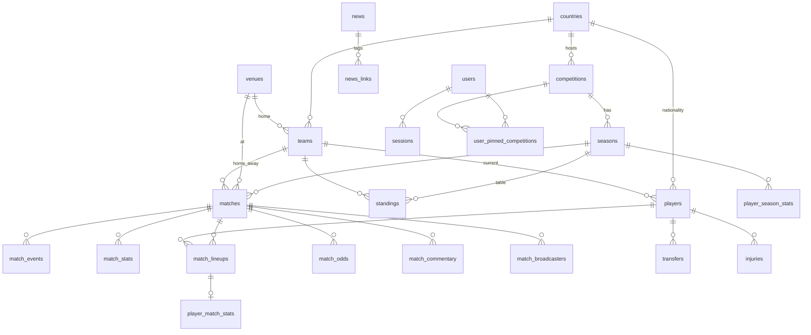

# Skema Database PostgreSQL - NewsScore

Hasil scan `app/types/match.ts`, `app/data/*`, `app/pages/*`, `app/components/*`, dan kontrak di `docs/api-contract-plan.md`.
Target: PostgreSQL 16. DDL di bagian 4 sudah dites jalan di PG 16 (tabel kosong).

---

## 1. Prinsip Desain

| Keputusan                                                                    | Alasan                                                                                                                                          |
| ---------------------------------------------------------------------------- | ----------------------------------------------------------------------------------------------------------------------------------------------- |
| PK `bigint identity` + kolom `slug` UNIQUE                                   | FE memakai slug sebagai `id` di URL (`liga-primer`, `arsenal`, `che-1`). API mengekspos `slug` sebagai `id`; join internal tetap pakai integer. |
| Kompetisi dipisah dari musim (`competitions` / `seasons`)                    | `League.season` + `League.archive` = satu kompetisi punya banyak musim.                                                                         |
| Tanggal disimpan `date` / `timestamptz`                                      | FE butuh `"DD.MM.YYYY"`; format di layer API, bukan di DB.                                                                                      |
| Waktu pertandingan = `kickoff_at` + `minute`                                 | `Match.time` = jam kick-off (scheduled) atau menit berjalan (live) → diturunkan di API.                                                         |
| Nama tim/pemain disimpan juga sebagai teks di tabel event/lineup/transfer    | Data mock punya pemain/klub tanpa `playerId` (`playerId?`), mis. klub luar liga ("Boreham Wood"). FK nullable + nama teks fallback.             |
| Statistik pertandingan generik (`stat_key`)                                  | `MatchStat` = daftar label bebas; tidak perlu kolom per statistik.                                                                              |
| Head-to-head, match log pemain, `liveCount`, `matchDates` **tidak disimpan** | Semua bisa diturunkan dari `matches` + `match_lineups` + `player_match_stats`.                                                                  |
| Klasemen **disimpan** (`standings`)                                          | Dibaca sangat sering (beranda, sidebar, halaman liga); ditulis ulang oleh job ingest setiap pertandingan selesai.                               |
| Pin hanya liga                                                               | UI hanya punya pin liga (`usePinnedLeagues`). Tambah tabel pin tim/negara saat UI-nya ada.                                                      |
| Sesi di tabel `sessions`                                                     | Auth pakai cookie HttpOnly (bukan JWT di JS) → cookie berisi token acak, DB simpan hash-nya.                                                    |

---

## 2. ERD


```mermaid
erDiagram
    countries ||--o{ competitions : hosts
    countries ||--o{ teams : ""
    countries ||--o{ players : nationality
    competitions ||--o{ seasons : has
    seasons ||--o{ standings : table
    seasons ||--o{ matches : ""
    seasons ||--o{ player_season_stats : ""
    teams ||--o{ standings : ""
    teams ||--o{ players : current
    venues ||--o{ teams : home
    venues ||--o{ matches : at
    teams ||--o{ matches : home_away
    matches ||--o{ match_events : ""
    matches ||--o{ match_stats : ""
    matches ||--o{ match_lineups : ""
    matches ||--o{ match_odds : ""
    matches ||--o{ match_commentary : ""
    matches ||--o{ match_broadcasters : ""
    players ||--o{ match_lineups : ""
    match_lineups ||--o| player_match_stats : ""
    players ||--o{ transfers : ""
    players ||--o{ injuries : ""
    news ||--o{ news_links : tags
    users ||--o{ sessions : ""
    users ||--o{ user_pinned_competitions : ""
    competitions ||--o{ user_pinned_competitions : ""
```

---

## 3. Pemetaan Tipe FE → Tabel

| Tipe FE                                  | Sumber                                                                                                     |
| ---------------------------------------- | ---------------------------------------------------------------------------------------------------------- |
| `Team { id, name, badge }`               | `teams.slug, name, short_code`                                                                             |
| `League`                                 | `competitions` + musim aktif di `seasons` (`is_current`)                                                   |
| `League.season` / `start` / `end`        | `seasons.label`, `starts_on`, `ends_on` (API format `"DD.MM"`)                                             |
| `League.standings[]`                     | `standings` join `teams` untuk musim aktif, urut `position`                                                |
| `StandingRow.form`                       | `standings.form` (`'WWDWW'`, terbaru dulu)                                                                 |
| `League.archive[]`                       | `seasons` non-aktif: `winner_team_id`, `runner_up_team_id`                                                 |
| `Match`                                  | `matches` + home/away `teams` + `venues`                                                                   |
| `Match.status`                           | `matches.status`; `'postponed'/'cancelled'` disiapkan tapi FE belum menampilkan                            |
| `Match.time`                             | live → `minute \|\| '\''`; lainnya → `to_char(kickoff_at AT TIME ZONE 'Asia/Jakarta','HH24:MI')`           |
| `Match.date`                             | `kickoff_at` zona Asia/Jakarta                                                                             |
| `Match.round`                            | `matches.round`                                                                                            |
| `Match.score` / `halfTime`               | `home_score, away_score` / `home_ht_score, away_ht_score` (null = belum mulai)                             |
| `Match.events[]`                         | `match_events` urut `minute, stoppage, id`                                                                 |
| `MatchEvent.assist`                      | `related_player_name` (assist gol, atau pemain yang diganti untuk `sub`)                                   |
| `Match.stats[]`                          | `match_stats` urut `sort_order`                                                                            |
| `Match.lineups`                          | `match_lineups` where `is_starter`                                                                         |
| `Match.headToHead[]`                     | query: 5 match `finished` terakhir antara kedua tim                                                        |
| `Match.odds[]`                           | `match_odds`                                                                                               |
| `Match.commentary[]`                     | `match_commentary` (`minute_label` teks, mis. `"45+2'"`)                                                   |
| `Match.playerStats[]`                    | `player_match_stats` join `match_lineups`                                                                  |
| `Match.referee/attendance/broadcasters`  | `matches.referee, attendance`, `match_broadcasters`                                                        |
| `TeamProfile`                            | `teams` + `venues` (`venue`, `capacity`, `city`)                                                           |
| `TeamProfile.leagueId`                   | `teams.primary_competition_id`                                                                             |
| `SquadPlayer`                            | `players` where `current_team_id`, + agregat `player_season_stats` musim aktif (matches/goals/assists)     |
| `TeamTransfer`                           | `transfers` where `from_team_id` atau `to_team_id` = tim; `direction` diturunkan                           |
| `PlayerProfile`                          | `players` + `countries`                                                                                    |
| `PlayerProfile.position` (label panjang) | dari `players.position` → `"Penjaga gawang"/"Bek"/"Gelandang"/"Penyerang"` di API                          |
| `PlayerProfile.age`                      | `date_part('year', age(birth_date))`                                                                       |
| `PlayerProfile.goalkeeper`               | `position = 'GK'`                                                                                          |
| `PlayerProfile.season`                   | agregat `player_season_stats` musim aktif                                                                  |
| `PlayerProfile.matchLog[]`               | query `match_lineups` + `player_match_stats` + `matches`, 10 terakhir                                      |
| `PlayerMatchLogEntry.outcome`            | dihitung dari skor + sisi tim pemain                                                                       |
| `PlayerMatchLogEntry.detail`             | kiper `saves/shots_faced`, lainnya `goals`/`assists`                                                       |
| `PlayerMatchLogEntry.note`               | `match_lineups.note` (mis. "Dibangku cadangan", "Cedera")                                                  |
| `CareerRow`                              | `player_season_stats` + `seasons` + `competitions`; `group` dari `competitions.type` + `teams.is_national` |
| `PlayerProfile.transfers[]`              | `transfers` where `player_id`                                                                              |
| `PlayerProfile.injuries[]`               | `injuries`                                                                                                 |
| `NewsItem`                               | `news`; `published` = label relatif dari `published_at` di API                                             |
| Country list / `/negara/:slug`           | `countries` yang punya `competitions`                                                                      |
| `/meta.sports`                           | tabel `sports` (hanya "Sepak Bola" aktif sekarang)                                                         |

`CareerGroup` mapping:

| kondisi                                      | group                 |
| -------------------------------------------- | --------------------- |
| `teams.is_national`                          | `Tim Nasional`        |
| `competitions.type = 'league'`               | `Liga`                |
| `type = 'cup'` dan `scope = 'domestic'`      | `Piala Domestik`      |
| `type = 'cup'` dan `scope = 'international'` | `Piala Internasional` |

---

## 4. DDL

```sql
CREATE EXTENSION IF NOT EXISTS citext;

-- ============ Enum ============
CREATE TYPE competition_type  AS ENUM ('league', 'cup', 'friendly');
CREATE TYPE competition_scope AS ENUM ('domestic', 'international');
CREATE TYPE match_status      AS ENUM ('scheduled', 'live', 'finished', 'postponed', 'cancelled');
CREATE TYPE match_side        AS ENUM ('home', 'away');
CREATE TYPE match_event_type  AS ENUM ('goal', 'own_goal', 'penalty_goal', 'yellow', 'second_yellow', 'red', 'sub');
CREATE TYPE player_position   AS ENUM ('GK', 'DF', 'MF', 'FW');
CREATE TYPE preferred_foot    AS ENUM ('left', 'right', 'both');
CREATE TYPE transfer_type     AS ENUM ('transfer', 'loan', 'loan_return', 'free', 'end_of_contract');

-- ============ Master ============
CREATE TABLE sports (
    id         smallint GENERATED ALWAYS AS IDENTITY PRIMARY KEY,
    slug       text NOT NULL UNIQUE,
    name       text NOT NULL,              -- "Sepak Bola"
    sort_order smallint NOT NULL DEFAULT 0,
    is_active  boolean NOT NULL DEFAULT false
);

CREATE TABLE countries (
    id       bigint GENERATED ALWAYS AS IDENTITY PRIMARY KEY,
    slug     text NOT NULL UNIQUE,         -- "inggris" (slugify di utils/slug.ts)
    name     text NOT NULL,                -- "Inggris"
    iso_code char(2) UNIQUE                -- "GB", untuk bendera
);

CREATE TABLE venues (
    id       bigint GENERATED ALWAYS AS IDENTITY PRIMARY KEY,
    name     text NOT NULL,
    city     text,
    capacity integer CHECK (capacity > 0),
    country_id bigint REFERENCES countries(id)
);

CREATE TABLE competitions (
    id         bigint GENERATED ALWAYS AS IDENTITY PRIMARY KEY,
    slug       text NOT NULL UNIQUE,       -- "liga-primer"
    sport_id   smallint NOT NULL REFERENCES sports(id),
    country_id bigint REFERENCES countries(id),   -- null untuk kompetisi internasional
    name       text NOT NULL,
    short_code text,                       -- "PL", "EFL" (dipakai matchLog.competition)
    type       competition_type NOT NULL DEFAULT 'league',
    scope      competition_scope NOT NULL DEFAULT 'domestic',
    sort_order integer NOT NULL DEFAULT 0
);
CREATE INDEX ON competitions (country_id);

CREATE TABLE teams (
    id                     bigint GENERATED ALWAYS AS IDENTITY PRIMARY KEY,
    slug                   text NOT NULL UNIQUE,   -- "chelsea"
    name                   text NOT NULL,
    short_code             text NOT NULL,          -- badge "CH"
    crest_url              text,
    country_id             bigint REFERENCES countries(id),
    venue_id               bigint REFERENCES venues(id),
    primary_competition_id bigint REFERENCES competitions(id),  -- TeamProfile.leagueId
    founded                smallint,
    is_national            boolean NOT NULL DEFAULT false
);

CREATE TABLE seasons (
    id                bigint GENERATED ALWAYS AS IDENTITY PRIMARY KEY,
    competition_id    bigint NOT NULL REFERENCES competitions(id) ON DELETE CASCADE,
    label             text NOT NULL,       -- "2026/2027"
    starts_on         date,
    ends_on           date,
    is_current        boolean NOT NULL DEFAULT false,
    winner_team_id    bigint REFERENCES teams(id),  -- archive
    runner_up_team_id bigint REFERENCES teams(id),
    UNIQUE (competition_id, label),
    CHECK (ends_on IS NULL OR starts_on IS NULL OR ends_on >= starts_on)
);
-- satu musim aktif per kompetisi
CREATE UNIQUE INDEX seasons_one_current ON seasons (competition_id) WHERE is_current;

CREATE TABLE players (
    id              bigint GENERATED ALWAYS AS IDENTITY PRIMARY KEY,
    slug            text NOT NULL UNIQUE,  -- "che-1"
    name            text NOT NULL,         -- "R. Sanchez"
    full_name       text,
    country_id      bigint REFERENCES countries(id),
    current_team_id bigint REFERENCES teams(id) ON DELETE SET NULL,
    shirt_number    smallint CHECK (shirt_number BETWEEN 1 AND 99),
    position        player_position NOT NULL,
    birth_date      date,
    height_cm       smallint CHECK (height_cm BETWEEN 120 AND 230),
    foot            preferred_foot,
    market_value_eur bigint CHECK (market_value_eur >= 0),   -- API format "€14,0 jt"
    contract_until  date
);
CREATE INDEX ON players (current_team_id);

-- ============ Klasemen ============
CREATE TABLE standings (
    season_id     bigint NOT NULL REFERENCES seasons(id) ON DELETE CASCADE,
    team_id       bigint NOT NULL REFERENCES teams(id),
    group_name    text NOT NULL DEFAULT '',   -- '' = satu tabel; "Grup A" untuk fase grup
    position      smallint NOT NULL,
    played        smallint NOT NULL DEFAULT 0,
    won           smallint NOT NULL DEFAULT 0,
    drawn         smallint NOT NULL DEFAULT 0,
    lost          smallint NOT NULL DEFAULT 0,
    goals_for     smallint NOT NULL DEFAULT 0,
    goals_against smallint NOT NULL DEFAULT 0,
    points        smallint NOT NULL DEFAULT 0,
    form          varchar(5) NOT NULL DEFAULT '' CHECK (form ~ '^[WDL]{0,5}$'),  -- terbaru dulu
    updated_at    timestamptz NOT NULL DEFAULT now(),
    PRIMARY KEY (season_id, team_id),
    UNIQUE (season_id, group_name, position) DEFERRABLE INITIALLY DEFERRED,
    CHECK (played = won + drawn + lost)
);

-- ============ Pertandingan ============
CREATE TABLE matches (
    id            bigint GENERATED ALWAYS AS IDENTITY PRIMARY KEY,
    slug          text NOT NULL UNIQUE,    -- "bre-che"
    season_id     bigint NOT NULL REFERENCES seasons(id),
    round         text,                    -- "Pekan 5"
    home_team_id  bigint NOT NULL REFERENCES teams(id),
    away_team_id  bigint NOT NULL REFERENCES teams(id),
    venue_id      bigint REFERENCES venues(id),
    kickoff_at    timestamptz NOT NULL,
    status        match_status NOT NULL DEFAULT 'scheduled',
    minute        smallint,                -- menit berjalan saat live
    home_score    smallint,
    away_score    smallint,
    home_ht_score smallint,
    away_ht_score smallint,
    referee       text,
    attendance    integer CHECK (attendance >= 0),
    updated_at    timestamptz NOT NULL DEFAULT now(),
    CHECK (home_team_id <> away_team_id),
    CHECK ((home_score IS NULL) = (away_score IS NULL)),
    CHECK (status <> 'finished' OR home_score IS NOT NULL)
);
CREATE INDEX ON matches (kickoff_at);
CREATE INDEX ON matches (season_id, kickoff_at);
CREATE INDEX ON matches (home_team_id, kickoff_at DESC);
CREATE INDEX ON matches (away_team_id, kickoff_at DESC);
CREATE INDEX matches_live ON matches (status) WHERE status = 'live';

CREATE TABLE match_events (
    id                  bigint GENERATED ALWAYS AS IDENTITY PRIMARY KEY,
    match_id            bigint NOT NULL REFERENCES matches(id) ON DELETE CASCADE,
    minute              smallint NOT NULL CHECK (minute BETWEEN 0 AND 130),
    stoppage            smallint NOT NULL DEFAULT 0,   -- 45+2 → minute 45, stoppage 2
    side                match_side NOT NULL,
    type                match_event_type NOT NULL,
    player_id           bigint REFERENCES players(id),
    player_name         text NOT NULL,
    related_player_id   bigint REFERENCES players(id), -- assist / pemain keluar
    related_player_name text,
    note                text
);
CREATE INDEX ON match_events (match_id, minute, stoppage);

CREATE TABLE match_stats (
    match_id   bigint NOT NULL REFERENCES matches(id) ON DELETE CASCADE,
    stat_key   text NOT NULL,              -- "possession"
    label      text NOT NULL,              -- "Penguasaan bola"
    home_value numeric(7,2) NOT NULL,
    away_value numeric(7,2) NOT NULL,
    is_percent boolean NOT NULL DEFAULT false,
    sort_order smallint NOT NULL DEFAULT 0,
    PRIMARY KEY (match_id, stat_key)
);

CREATE TABLE match_lineups (
    id           bigint GENERATED ALWAYS AS IDENTITY PRIMARY KEY,
    match_id     bigint NOT NULL REFERENCES matches(id) ON DELETE CASCADE,
    side         match_side NOT NULL,
    player_id    bigint REFERENCES players(id),
    player_name  text NOT NULL,
    shirt_number smallint,
    is_starter   boolean NOT NULL DEFAULT true,
    note         text,                     -- "Dibangku cadangan", "Cedera"
    UNIQUE (match_id, player_id)
);
CREATE INDEX ON match_lineups (player_id);

CREATE TABLE player_match_stats (
    lineup_id      bigint PRIMARY KEY REFERENCES match_lineups(id) ON DELETE CASCADE,
    minutes_played smallint NOT NULL DEFAULT 0,
    rating         numeric(3,1) CHECK (rating BETWEEN 0 AND 10),
    goals          smallint NOT NULL DEFAULT 0,
    assists        smallint NOT NULL DEFAULT 0,
    shots          smallint NOT NULL DEFAULT 0,
    saves          smallint,               -- kiper
    shots_faced    smallint,               -- kiper
    yellow_cards   smallint NOT NULL DEFAULT 0,
    red_cards      smallint NOT NULL DEFAULT 0
);

CREATE TABLE match_odds (
    match_id   bigint NOT NULL REFERENCES matches(id) ON DELETE CASCADE,
    bookmaker  text NOT NULL,
    home       numeric(6,2) NOT NULL CHECK (home > 1),
    draw       numeric(6,2) NOT NULL CHECK (draw > 1),
    away       numeric(6,2) NOT NULL CHECK (away > 1),
    updated_at timestamptz NOT NULL DEFAULT now(),
    PRIMARY KEY (match_id, bookmaker)
);

CREATE TABLE match_commentary (
    id           bigint GENERATED ALWAYS AS IDENTITY PRIMARY KEY,
    match_id     bigint NOT NULL REFERENCES matches(id) ON DELETE CASCADE,
    minute_label text NOT NULL,            -- "67'", "45+2'", "HT"
    text         text NOT NULL,
    highlight    boolean NOT NULL DEFAULT false,
    created_at   timestamptz NOT NULL DEFAULT now()
);
CREATE INDEX ON match_commentary (match_id, id DESC);

CREATE TABLE match_broadcasters (
    match_id    bigint NOT NULL REFERENCES matches(id) ON DELETE CASCADE,
    broadcaster text NOT NULL,
    PRIMARY KEY (match_id, broadcaster)
);

-- ============ Statistik & riwayat pemain ============
-- Satu baris per pemain x tim x musim kompetisi. Sumber CareerRow, PlayerProfile.season, SquadPlayer.matches/goals/assists.
CREATE TABLE player_season_stats (
    player_id    bigint NOT NULL REFERENCES players(id) ON DELETE CASCADE,
    season_id    bigint NOT NULL REFERENCES seasons(id),
    team_id      bigint NOT NULL REFERENCES teams(id),
    appearances  smallint NOT NULL DEFAULT 0,
    minutes      integer  NOT NULL DEFAULT 0,
    goals        smallint NOT NULL DEFAULT 0,
    assists      smallint NOT NULL DEFAULT 0,
    yellow_cards smallint NOT NULL DEFAULT 0,
    red_cards    smallint NOT NULL DEFAULT 0,
    avg_rating   numeric(3,2),
    clean_sheets smallint,                 -- kiper
    save_pct     numeric(5,2),             -- kiper
    PRIMARY KEY (player_id, season_id, team_id)
);
CREATE INDEX ON player_season_stats (season_id, team_id);

CREATE TABLE transfers (
    id             bigint GENERATED ALWAYS AS IDENTITY PRIMARY KEY,
    player_id      bigint REFERENCES players(id) ON DELETE CASCADE,
    player_name    text NOT NULL,
    from_team_id   bigint REFERENCES teams(id),
    from_team_name text,                   -- klub di luar DB
    to_team_id     bigint REFERENCES teams(id),
    to_team_name   text,
    transfer_date  date NOT NULL,
    season_label   text NOT NULL,          -- "2026/2027"
    type           transfer_type NOT NULL DEFAULT 'transfer',
    fee_eur        bigint CHECK (fee_eur >= 0),
    fee_label      text,                   -- "€45 jt", "Bebas", "Peminjaman"
    CHECK (from_team_id IS NOT NULL OR from_team_name IS NOT NULL),
    CHECK (to_team_id   IS NOT NULL OR to_team_name   IS NOT NULL)
);
CREATE INDEX ON transfers (player_id, transfer_date DESC);
CREATE INDEX ON transfers (from_team_id, transfer_date DESC);
CREATE INDEX ON transfers (to_team_id, transfer_date DESC);

CREATE TABLE injuries (
    id           bigint GENERATED ALWAYS AS IDENTITY PRIMARY KEY,
    player_id    bigint NOT NULL REFERENCES players(id) ON DELETE CASCADE,
    season_label text NOT NULL,
    issue        text NOT NULL,            -- "Cedera hamstring"
    started_on   date NOT NULL,
    ended_on     date,                     -- null = masih cedera
    CHECK (ended_on IS NULL OR ended_on >= started_on)
);
CREATE INDEX ON injuries (player_id, started_on DESC);

-- ============ Berita ============
CREATE TABLE news (
    id           bigint GENERATED ALWAYS AS IDENTITY PRIMARY KEY,
    slug         text NOT NULL UNIQUE,
    category     text NOT NULL,            -- "Resmi", "Wawancara", "Cedera", "Statistik"
    title        text NOT NULL,
    summary      text NOT NULL,
    body         text,
    image_url    text,
    published_at timestamptz,              -- null = draft
    created_at   timestamptz NOT NULL DEFAULT now()
);
CREATE INDEX news_published ON news (published_at DESC, id DESC) WHERE published_at IS NOT NULL;

-- Relasi berita ke entitas, untuk filter ?matchId= / ?leagueId= / ?teamId= / pemain.
CREATE TABLE news_links (
    news_id        bigint NOT NULL REFERENCES news(id) ON DELETE CASCADE,
    match_id       bigint REFERENCES matches(id) ON DELETE CASCADE,
    competition_id bigint REFERENCES competitions(id) ON DELETE CASCADE,
    team_id        bigint REFERENCES teams(id) ON DELETE CASCADE,
    player_id      bigint REFERENCES players(id) ON DELETE CASCADE,
    CHECK (num_nonnulls(match_id, competition_id, team_id, player_id) = 1)
);
CREATE INDEX ON news_links (news_id);
CREATE INDEX ON news_links (match_id)       WHERE match_id IS NOT NULL;
CREATE INDEX ON news_links (competition_id) WHERE competition_id IS NOT NULL;
CREATE INDEX ON news_links (team_id)        WHERE team_id IS NOT NULL;
CREATE INDEX ON news_links (player_id)      WHERE player_id IS NOT NULL;

-- ============ Akun, sesi, pin ============
CREATE TABLE users (
    id            bigint GENERATED ALWAYS AS IDENTITY PRIMARY KEY,
    email         citext NOT NULL UNIQUE,
    password_hash text NOT NULL,           -- argon2id
    name          text NOT NULL,
    created_at    timestamptz NOT NULL DEFAULT now()
);

CREATE TABLE sessions (
    token_hash   bytea PRIMARY KEY,        -- sha256(token di cookie); token mentah tidak disimpan
    user_id      bigint NOT NULL REFERENCES users(id) ON DELETE CASCADE,
    created_at   timestamptz NOT NULL DEFAULT now(),
    last_seen_at timestamptz NOT NULL DEFAULT now(),
    expires_at   timestamptz NOT NULL,
    user_agent   text,
    ip           inet
);
CREATE INDEX ON sessions (user_id);
CREATE INDEX ON sessions (expires_at);

CREATE TABLE user_pinned_competitions (
    user_id        bigint NOT NULL REFERENCES users(id) ON DELETE CASCADE,
    competition_id bigint NOT NULL REFERENCES competitions(id) ON DELETE CASCADE,
    created_at     timestamptz NOT NULL DEFAULT now(),
    PRIMARY KEY (user_id, competition_id)
);
```

---

## 5. Query Kunci

```sql
-- GET /matches?date=20.09.2026  (tanggal lokal WIB)
SELECT m.*, h.slug AS home_slug, h.name AS home_name, h.short_code AS home_badge,
       a.slug AS away_slug, a.name AS away_name, a.short_code AS away_badge,
       c.slug AS league_slug
FROM matches m
JOIN teams h ON h.id = m.home_team_id
JOIN teams a ON a.id = m.away_team_id
JOIN seasons s ON s.id = m.season_id
JOIN competitions c ON c.id = s.competition_id
WHERE m.kickoff_at >= ('2026-09-20'::date::timestamp AT TIME ZONE 'Asia/Jakarta')
  AND m.kickoff_at <  ('2026-09-21'::date::timestamp AT TIME ZONE 'Asia/Jakarta')
ORDER BY c.sort_order, m.kickoff_at, m.id;

-- /meta.liveCount
SELECT count(*) FROM matches WHERE status = 'live';

-- /meta.matchDates (7 hari di sekitar hari ini yang punya pertandingan)
SELECT DISTINCT (kickoff_at AT TIME ZONE 'Asia/Jakarta')::date AS d
FROM matches
WHERE kickoff_at BETWEEN now() - interval '3 days' AND now() + interval '4 days'
ORDER BY d;

-- Head-to-head (Match.headToHead)
SELECT m.kickoff_at, m.home_score, m.away_score, h.name, a.name
FROM matches m
JOIN teams h ON h.id = m.home_team_id
JOIN teams a ON a.id = m.away_team_id
WHERE m.status = 'finished'
  AND LEAST(m.home_team_id, m.away_team_id)    = LEAST($1, $2)
  AND GREATEST(m.home_team_id, m.away_team_id) = GREATEST($1, $2)
  AND m.id <> $3
ORDER BY m.kickoff_at DESC LIMIT 5;

-- Match log pemain (PlayerProfile.matchLog)
SELECT m.slug, m.kickoff_at, c.short_code, co.name AS country,
       h.name AS home, a.name AS away, m.home_score, m.away_score, l.side, l.note,
       ps.rating, ps.minutes_played, ps.goals, ps.assists, ps.saves, ps.shots_faced,
       ps.yellow_cards, ps.red_cards
FROM match_lineups l
JOIN matches m ON m.id = l.match_id AND m.status = 'finished'
JOIN seasons s ON s.id = m.season_id
JOIN competitions c ON c.id = s.competition_id
LEFT JOIN countries co ON co.id = c.country_id
JOIN teams h ON h.id = m.home_team_id
JOIN teams a ON a.id = m.away_team_id
LEFT JOIN player_match_stats ps ON ps.lineup_id = l.id
WHERE l.player_id = $1
ORDER BY m.kickoff_at DESC LIMIT 10;

-- Cursor pagination berita: cursor = base64(published_at, id)
SELECT * FROM news
WHERE published_at IS NOT NULL
  AND (published_at, id) < ($1, $2)
ORDER BY published_at DESC, id DESC
LIMIT $3 + 1;   -- baris ke-(limit+1) ada → kirim nextCursor
```

---

## 6. Catatan Operasional

- **Ingest data:** tabel pertandingan diisi job/worker dari provider data (bukan dari FE). Saat match `finished`: update `standings`, `player_season_stats` dalam satu transaksi.
- **Live:** worker update `matches.minute/score/status`, insert `match_events`, `match_commentary`. FE polling; cache response `/matches/:id` live ≤ 15 detik.
- **Sesi:** hapus `sessions` kedaluwarsa via cron harian (`DELETE FROM sessions WHERE expires_at < now()`).
- **Belum dimodelkan (tidak dipakai FE):** pin tim/negara, pelatih, klasemen home/away, xG, heatmap, multi-bahasa. Tambah saat UI butuh.
- **Seed:** `app/data/*` bisa dikonversi jadi seed awal untuk dev.
